This page will go over the governing structure of each faction

# N.E.T.

```mermaid.initialize()
graph TD
M[The Prime Manufactorius]
V[Freya Viresyx]
1[inner circle 1]

h1[hi-exc1]
h2[hi-exc2]
h3[hi-exc3]
h4[hi-exc4]

p1[Lars Torsten]
p2[pgov2]
p3[pgov3]
p4[pgov4]
p5[pgov5]
p6[pgov6]
p7[pgov7]
p8[pgov8]

p1-1[Lars sitt hjem]
p1-2[p1s2]
p1-3[Kaldt sted]
p1-4[p1s4]
p1-5[p1s5]
p1-6[p1s6]
p1-7[p1s7]
p1-8[p1s8]

p2-1[p2s1]
p2-2[p2s2]
p2-3[p2s3]
p2-4[p2s4]
p2-5[p2s5]
p2-6[p2s6]
p2-7[p2s7]
p2-8[p2s8]

p3-1[p3s1]
p3-2[p3s2]
p3-3[p3s3]
p3-4[p3s4]
p3-5[p3s5]
p3-6[p3s6]
p3-7[p3s7]
p3-8[p3s8]

p4-1[p4s1]
p4-2[p4s2]
p4-3[p4s3]
p4-4[p4s4]
p4-5[p4s5]
p4-6[p4s6]
p4-7[p4s7]
p4-8[p4s8]

p5-1[p5s1]
p5-2[p5s2]
p5-3[p5s3]
p5-4[p5s4]
p5-5[p5s5]
p5-6[p5s6]
p5-7[p5s7]
p5-8[p5s8]

p6-1[p6s1]
p6-2[p6s2]
p6-3[p6s3]
p6-4[p6s4]
p6-5[p6s5]
p6-6[p6s6]
p6-7[p6s7]
p6-8[p6s8]

p7-1[p7s1]
p7-2[p7s2]
p7-3[p7s3]
p7-4[p7s4]
p7-5[p7s5]
p7-6[p7s6]
p7-7[p7s7]
p7-8[p7s8]

p8-1[p8s1]
p8-2[p8s2]
p8-3[p8s3]
p8-4[p8s4]
p8-5[p8s5]
p8-6[p8s6]
p8-7[p8s7]
p8-8[p8s8]

class M,V,1,h1,h2,h3,h4,p1,p2,p3,p4,p5,p6,p7,p8,p1-1,p1-2,p1-3,p1-4,p1-5,p1-6,p1-7,p1-8,p2-1,p2-2,p2-3,p2-4,p2-5,p2-6,p2-7,p2-8,p3-1,p3-2,p3-3,p3-4,p3-5,p3-6,p3-7,p3-8,p4-1,p4-2,p4-3,p4-4,p4-5,p4-6,p4-7,p4-8,p5-1,p5-2,p5-3,p5-4,p5-5,p5-6,p5-7,p5-8,p6-1,p6-2,p6-3,p6-4,p6-5,p6-6,p6-7,p6-8,p7-1,p7-2,p7-3,p7-4,p7-5,p7-6,p7-7,p7-8,p8-1,p8-2,p8-3,p8-4,p8-5,p8-6,p8-7,p8-8, internal-link;

M ---> 1
M ---> V

V ---> h1
V ---> h2
V ---> h3
V ---> h4

1 ---> h1
1 ---> h2
1 ---> h3
1 ---> h4

h1 ------> p1
h1 ------> p2
h1 ------> p3
h1 ------> p4
h1 ------> p5
h1 ------> p6
h1 ------> p7
h1 ------> p8

h2 ------> p1
h2 ------> p2
h2 ------> p3
h2 ------> p4
h2 ------> p5
h2 ------> p6
h2 ------> p7
h2 ------> p8

h3 ------> p1
h3 ------> p2
h3 ------> p3
h3 ------> p4
h3 ------> p5
h3 ------> p6
h3 ------> p7
h3 ------> p8

h4 ------> p1
h4 ------> p2
h4 ------> p3
h4 ------> p4
h4 ------> p5
h4 ------> p6
h4 ------> p7
h4 ------> p8

p1 ---> p1-1
p1 ---> p1-2
p1 ---> p1-3
p1 ---> p1-4
p1 ---> p1-5
p1 ---> p1-6
p1 ---> p1-7
p1 ---> p1-8

p2 ---> p2-1
p2 ---> p2-2
p2 ---> p2-3
p2 ---> p2-4
p2 ---> p2-5
p2 ---> p2-6
p2 ---> p2-7
p2 ---> p2-8

p3 ---> p3-1
p3 ---> p3-2
p3 ---> p3-3
p3 ---> p3-4
p3 ---> p3-5
p3 ---> p3-6
p3 ---> p3-7
p3 ---> p3-8

p4 ---> p4-1
p4 ---> p4-2
p4 ---> p4-3
p4 ---> p4-4
p4 ---> p4-5
p4 ---> p4-6
p4 ---> p4-7
p4 ---> p4-8

p5 ---> p5-1
p5 ---> p5-2
p5 ---> p5-3
p5 ---> p5-4
p5 ---> p5-5
p5 ---> p5-6
p5 ---> p5-7
p5 ---> p5-8

p6 ---> p6-1
p6 ---> p6-2
p6 ---> p6-3
p6 ---> p6-4
p6 ---> p6-5
p6 ---> p6-6
p6 ---> p6-7
p6 ---> p6-8

p7 ---> p7-1
p7 ---> p7-2
p7 ---> p7-3
p7 ---> p7-4
p7 ---> p7-5
p7 ---> p7-6
p7 ---> p7-7
p7 ---> p7-8

p8 ---> p8-1
p8 ---> p8-2
p8 ---> p8-3
p8 ---> p8-4
p8 ---> p8-5
p8 ---> p8-6
p8 ---> p8-7
p8 ---> p8-8

```

---
## CEO
[[The Prime Manufactorius]]

---
## Inner Circle
[[Freya Viresyx]]
[[inner circle 1]]

---
## High Executives
[[hi-exc1]]
[[hi-exc2]]
[[hi-exc3]]
[[hi-exc4]]

---
## Planetary Governors
[[Lars Torsten]]
[[pgov2]]
[[pgov3]]
[[pgov4]]
[[pgov5]]
[[pgov6]]
[[pgov7]]
[[pgov8]]

---
## Sector Governors
---
### Planet 1
[[Lars sitt hjem]]
[[p1s2]]
[[Kaldt sted]]
[[p1s4]]
[[p1s5]]
[[p1s6]]
[[p1s7]]
[[p1s8]]

---
### Planet 2
[[p2s1]]
[[p2s2]]
[[p2s3]]
[[p2s4]]
[[p2s5]]
[[p2s6]]
[[p2s7]]
[[p2s8]]

---
### Planet 3
[[p3s1]]
[[p3s2]]
[[p3s3]]
[[p3s4]]
[[p3s5]]
[[p3s6]]
[[p3s7]]
[[p3s8]]

---
### Planet 4
[[p4s1]]
[[p4s2]]
[[p4s3]]
[[p4s4]]
[[p4s5]]
[[p4s6]]
[[p4s7]]
[[p4s8]]

---
### Planet 5
[[p5s1]]
[[p5s2]]
[[p5s3]]
[[p5s4]]
[[p5s5]]
[[p5s6]]
[[p5s7]]
[[p5s8]]

---
### Planet 6
[[p6s1]]
[[p6s2]]
[[p6s3]]
[[p6s4]]
[[p6s5]]
[[p6s6]]
[[p6s7]]
[[p6s8]]

---
### Planet 7
[[p7s1]]
[[p7s2]]
[[p7s3]]
[[p7s4]]
[[p7s5]]
[[p7s6]]
[[p7s7]]
[[p7s8]]

---
### Planet 8
[[p8s1]]
[[p8s2]]
[[p8s3]]
[[p8s4]]
[[p8s5]]
[[p8s6]]
[[p8s7]]
[[p8s8]]

---
## [[Sector divisions]]
---

